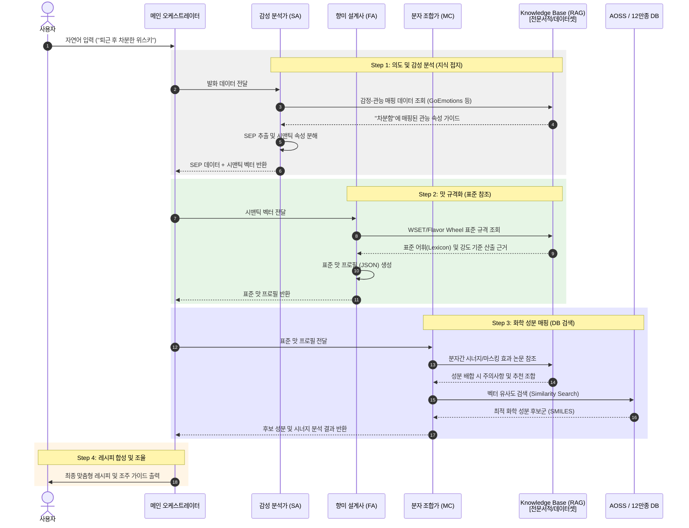

## TL;DT:  
사용자 자연어에서 상황/감정/취향(SEP)을 추출 → 표준화된 맛 프로필(JSON)로 변환 → 12만종 성분 DB에서 향미/화학적 조합 추천 → 제조 가능/안전성 자동 검증 및 실시간 사용자 조율까지 지원하는 AI 멀티 에이전트 기반 플레이버 큐레이션 파이프라인.

## AI 플레이버 큐레이터: 맞춤 향미 경험 추천 파이프라인

### 전체 흐름 요약

AI 플레이버 큐레이터 시스템은 사용자의 자연어 요청에서 상황·감정·취향(SEP)을 분석하여 표준 맛 프로필을 생성하고, 여기에 기반해 음식/음료 레시피를 만듭니다. 장점: 심층 취향 반영, 방대한 DB에 근거한 추천, 제조 가능성과 안전성까지 일괄 자동화.

---

### 주요 단계

#### 1. SEP(상황·감정·취향) 추출 및 시맨틱 특징 분석
- **SEP 추출**: 자연어에서 상황(S), 감정(E), 취향(P) 정보 자동 분리  
  - 예: `"마감 후 홀가분하지만 조금은 차분해지고 싶어"` → *Relief + Calm*
- **시맨틱 속성 추출**: LLM이 텍스트에서 잠재 감각 속성(예: Mood, 연상, 맛 방향 등) 분석
  - 예: 고조된, 차가운, 화사한 등
- **Context Buffer**: 이전 대화까지 고려해 일관된 취향 추적

#### 2. 표준 어휘 및 맛 벡터 변환
- **Flavor Wheel**: 국제 표준 용어로 시맨틱 벡터 매핑 (예: Flavor_Woody, Flavor_Acidic)
- 각 속성별로 강도(0.0~1.0) 부여 → 벡터화된 표준 맛 프로필 완성

#### 3. RAG 기반 화학 성분 검색/매핑
- 콘텍스트와 가장 어울리는 화학 성분을 12만종 DB에서 탐색/추천  
  - 예: '차분함'→테르펜, '홀가분함'→에스테르

#### 4. 에이전트 기반 레시피 조합 및 실시간 조율
- 강화학습 활용 레시피 합성  
- 재료 부재/안정성 이슈 시 사용자에게 대안 제시(예: 탄산 추가 등 피드백 루프)

#### 5. Guardrails: 안전성 검증/필터링
- 금지 성분, 비위생·부적절 조합 레시피 자동 필터링

---

### 기존 대화형 vs AWS Agent형 비교

|        | 기존 대화형 LLM                | AWS 에이전트형 (추천)                          |
|--------|------------------------------|-----------------------------------------------|
| 정확도   | 범용 지식 의존                 | RAG+대규모 DB에 기반한 추천                    |
| 수행능력 | 레시피 추천에 한정              | 주문·기계 제어 등 액션/실제 처리가능           |
| 개인화   | 대화 내 맥락만 반영             | DynamoDB와 연동, 장기적 취향 추적             |
| 운영효율 | 독립 LLM 관리 필요              | 서버리스 구조, 대용량 확장성                   |

---

### 맛 프로필 표준화 체계

1. **Flavor Wheel 규격화**  
   - ISO 5492 등 국제표준 플레이버 휠 어휘로 계층화 DB 구축  
   - 주요 감각 표준어 선정 (예: Flavor_Woody, Body_Heavy)
2. **수치화(Intensity Normalization)**  
   - 각 어휘를 강도(0~1)로 정량화하여 맛 프로필(JSON) 생성  
   - 예: `{"Floral": 0.8, "Citrus": 0.5, "Sweet": 0.2}`
   - VectorDB 내 향미 좌표값으로 활용

#### 규격 예시 표
| 구분         | 항목              | 역할         | 표준(예시)                |
|-------------|------------------|-------------|-------------------------|
| 언어 규격      | Sensory Lexicon  | 단어 표준화   | Flavor Wheel (ISO 등)    |
| 데이터 규격    | Intensity (0~1)  | 강도 수치화   | LLM 분석 결과            |
| 물리 규격      | Chemical Link    | 성분 결합     | DB(SMILES 등)            |

---

### 전체 프로세스 요약 단계

| 단계                | 설명                                 |
|---------------------|--------------------------------------|
| 자연어 입력         | 사용자 질문 입력                      |
| SEP 추출            | 상황/감정/취향 정보 분리              |
| 시맨틱 특징 추출     | 의미 기반 감각 정보 추출               |
| 표준 Lexicon 변환   | 플레이버 휠 표준 단어로 매핑           |
| 수치 규격화         | 각 어휘별 0~1 점수화                   |
| 매핑 (AOSS)         | 벡터 좌표 추출 및 DB 매칭              |
| 투영                | DB에서 최적 성분 후보군 선택            |
| 출력                | 완성 레시피(예: 장미향/시트러스 등) 반환 |

---

### 참고 데이터셋 및 개념

- **SEP**  
  - Situation: FlavorDB/FlavorGraph
  - Emotion: GoEmotions-Korean, Taste-Emotion 맵핑
  - Preference: FlavorSense
- **Flavor Wheel**  
  - 정규화/계층화된 플레이버 휠 구조 사용

---

#### 추상화 단계 도식

**마음(자연어) → 개념(시맨틱) → 규격(플레이버 휠) → 물리(화학물)**  
(자연어 → 의미/맥락 → 표준화 어휘/수치 → 성분 추천)

| 에이전트 명칭                 | 담당 파이프라인 단계             | 주요 역할 및 도구 |
|----------------------------|------------------------------|------------------|
| 감성 분석가 (Sensory Analyst)     | SEP 추출, 시맨틱 분석         | 추상적/감성어 해석, 감각 벡터 생성 - **GoEmotions-Korean RAG** 활용 |
| 향미 설계사 (Flavor Architect)    | Lexicon 변환, 수치화          | 의미를 플래버휠 표준(0~1) 프로필로 변환 |
| 분자 조합가 (Molecular Chemist)   | DB매핑, 성분 투영             | 12만종 성분 검색, 시너지 고려, AOSS(VectorDB) |
| 조주 마스터 (Mixologist Agent)    | 레시피 합성 및 조율            | 레시피 완성 및 재료 부족 시 사용자와 상호작용 |

- **AWS 기반 멀티 에이전트 워크플로우**
  - Amazon Bedrock 기반 Orchestration 운용
  - 메인 Agent가 사용자 입력(예: "황소 같은 위스키")을 받으면 각 전문 에이전트에게 순차 할당
  - **연쇄형 추론(Chained Reasoning):**  
    - 감성 분석가 → SEP 데이터  
    - 향미 설계사 → 정량화된 맛 프로필(JSON)
    - 분자 조합가 → Lambda 함수 변환 통해 AOSS 질의 및 성분 후보군 추천
  - **인터랙티브 루프(Human-in-the-loop):**  
    - 부족한 성분/이슈 발생 시 조주 마스터가 즉시 사용자에게 대안 제시 및 피드백 반영
  - **최종 Guardrails:**  
    - 모든 결과물은 Bedrock Guardrails 통과하여 안전성 검증

