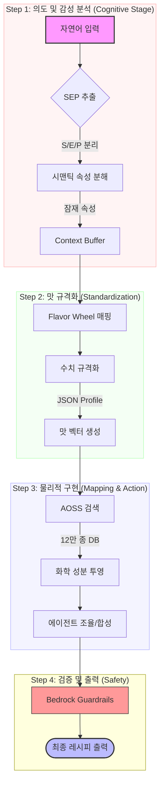

## AI 플레이버 큐레이터: 맞춤 향미 경험 추천 파이프라인

### 전체 흐름 요약

AI 플레이버 큐레이터 시스템은 사용자의 자연어 요청에서 상황·감정·취향(SEP)을 해석하여 표준화된 맛 프로필을 만들고, 이를 바탕으로 식음료 레시피를 생성합니다. 강점은 심층 취향 분석, 방대한 DB 기반의 추천, 그리고 제조 가능성과 안전성까지 고려한 자동화입니다.

---

### 주요 단계

#### 1. SEP(상황·감정·취향) 추출 및 시맨틱 특징 분석
- **SEP 데이터**: 사용자의 발화에서 상황(S), 감정(E), 취향(P) 자동 분리
  - 예: `"마감 후 홀가분하지만 조금은 차분해지고 싶어"` → *Relief + Calm*
- **시맨틱 속성 분해**: LLM이 텍스트를 잠재 속성(Mood, 연상, 맛 방향 등)으로 분석
  - 예: 고조된, 차가운, 화사한 등
- **Context Buffer**: 과거 대화 맥락까지 반영하여 취향을 지속 파악

#### 2. 표준 어휘화 및 맛 벡터 규격화
- **Flavor Wheel** 표준 용어로 시맨틱 벡터 매핑 (예: Flavor_Woody, Flavor_Acidic)
- 각 어휘에 강도(0.0 ~ 1.0) 부여 → 벡터 프로필로 표준화

#### 3. RAG 기반 화학 성분 검색 및 매핑
- 맥락에 부합하는 화학 성분 후보를 12만 종 DB에서 탐색하여 추천
  - 예: ‘차분함’→ 테르펜, ‘홀가분함’→ 에스테르

#### 4. 에이전트 기반 레시피/액션 및 실시간 조율
- 최적 레시피 합성(강화학습 활용)
- 제조 불가/불안정 시, 사용자와 상호작용적 조율 (탄산감 추가 등 논의)

#### 5. Guardrails 및 안전성/적합성 검증
- 금지 성분·비위생 조합·부적절 레시피 필터링

---

### 기존 대화형과 AWS Agent형 비교

|        | 기존 대화형 LLM                 | AWS 에이전트형 (추천)                            |
|--------|-------------------------------|------------------------------------------------|
| 정확도   | 범용 지식 의존                  | RAG + 대규모 DB 근거 답변                      |
| 수행능력 | 레시피 추천에 한정               | 주문·설비 제어, 액션 처리 가능                  |
| 개인화   | 대화 중 맥락만 반영              | DynamoDB 연동 장기 취향 반영                    |
| 운영효율 | 모델 직접 관리 필요               | Serverless 구조, 대규모 확장 용이               |

---

### 맛 프로필 표준화 체계

1. **Flavor Wheel 규격**  
   - 업계 표준(ISO 5492 등)의 플레이버 휠 용어를 계층별로 DB화
   - 주요 감각 기술어 선정 (예: Flavor_Woody, Body_Heavy)
2. **수치화(Intensity Normalization)**
   - 강도(0~1)로 변환하여 하나의 질의마다 맛 프로필(JSON) 생성  
   - 예: `{"Floral": 0.8, "Citrus": 0.5, "Sweet": 0.2}`
   - 이 데이터는 VectorDB에서 향미 좌표로 활용됨

#### 규격 기준 예시
| 규격 종류   | 항목               | 역할            | 기준(예시)                |
|------------|------------------|---------------|-------------------------|
| 언어 규격   | Sensory Lexicon  | 단어 표준화      | Flavor Wheel (ISO 표준)  |
| 데이터 규격 | Intensity (0~1)  | 강도 수치화      | LLM 분석                 |
| 물리 규격   | Chemical Link    | 성분 결합        | DB(SMILES 등)            |

---

### 전체 프로세스 단계 요약

| 단계                | 설명                                 |
|---------------------|--------------------------------------|
| 자연어 입력         | 사용자 요청 입력                      |
| SEP 추출            | 상황/감정/취향 데이터 분리 추출         |
| 시맨틱 특징 추출     | 의미 기반 감각 정보 추출               |
| 표준 Lexicon 변환   | 플레이버 휠 기반 표준 단어 매핑         |
| 수치 규격화         | 각 어휘를 0~1로 수치화                 |
| 매핑 (AOSS)         | 벡터 좌표 추출 및 DB 매칭              |
| 투영                | 성분 데이터 베이스에서 후보 성분 선택    |
| 출력                | 레시피(예: Geraniol/장미향 등) 완성     |

---

### 참고 데이터셋 및 개념

- **SEP**  
  - Situation: FlavorDB/FlavorGraph 등
  - Emotion: GoEmotions-Korean, Taste-Emotion 맵핑
  - Preference: FlavorSense 등

- **Flavor Wheel**  
  - 플레이버 휠을 통한 표준화, 개방형 트리 구조 채택

---

#### 추상화 단계 구분

**마음(자연어) → 개념(시맨틱) → 규격(플레이버 휠) → 물리(화합물)**  
(자연어 발화→맥락 및 의미 추출→표준 어휘 및 수치화→DB 및 물질 추천)

| 에이전트 명칭             | 담당 파이프라인 단계         | 핵심 역할 및 도구 (Tools)                                                                                                                                                        |
|-------------------------|-----------------------------|---------------------------------------------------------------------------------------------------------------------------------------------------------------------------------|
| 감성 분석가 (Sensory Analyst)   | SEP 추출, 시맨틱 분석       | 사용자의 추상적 발화에서 심리적/맥락적 의도를 파악하여 감각 벡터를 생성 - **GoEmotions-Korean RAG 활용**                                                                       |
| 향미 설계사 (Flavor Architect)  | Lexicon 변환, 수치화        | 추출된 의도를 WSET/플레이버 휠 규격으로 번역하고 0.0~1.0 사이의 정밀한 강도 수치를 결정                                                                                           |
| 분자 조합가 (Molecular Chemist) | AOSS 매핑, 성분 투영         | **AOSS(VectorDB)**에서 12만 종의 성분을 검색하고, 분자 간의 시너지를 고려하여 최적의 화학 성분 후보군을 선정                                                                   |
| 조주 마스터 (Mixologist Agent)   | 레시피 합성, 사용자 조율      | 최종 레시피를 완성하며, 재료 부족이나 제조 불가 시 사용자에게 대안을 제시하고, 대화를 통해 레시피를 수정                                                                   |

- **AWS 기반 멀티 에이전트 워크플로우**
  - Amazon Bedrock의 Orchestration 기능을 활용하여 전체 구동
  - 메인 오케스트레이터(Main Agent)가 사용자 입력(예: "황소 같은 위스키")을 수신하고 감성 분석가에게 업무 배정
  - **연쇄적 추론(Chained Reasoning)**
    - 감성 분석가가 SEP 데이터를 추출/생성
    - 향미 설계사가 SEP 데이터를 받아 수치 프로필(JSON) 생성
    - 분자 조합가가 해당 JSON을 Lambda 함수로 AOSS 쿼리로 변환 및 성분 검색
  - **인터랙티브 루프(Human-in-the-loop)**
    - 성분이 부족할 경우, 조주 마스터가 사용자에게 예시처럼 "현재 스모키한 성분이 부족한데, 대신 오크향을 강화할까요?" 등 대안 제안 및 상호작용 진행
  - **최종 가드레일(Bedrock Guardrails)**
    - 모든 에이전트 결과물은 최종 출력 전 안전성 검사 레이어를 통과

