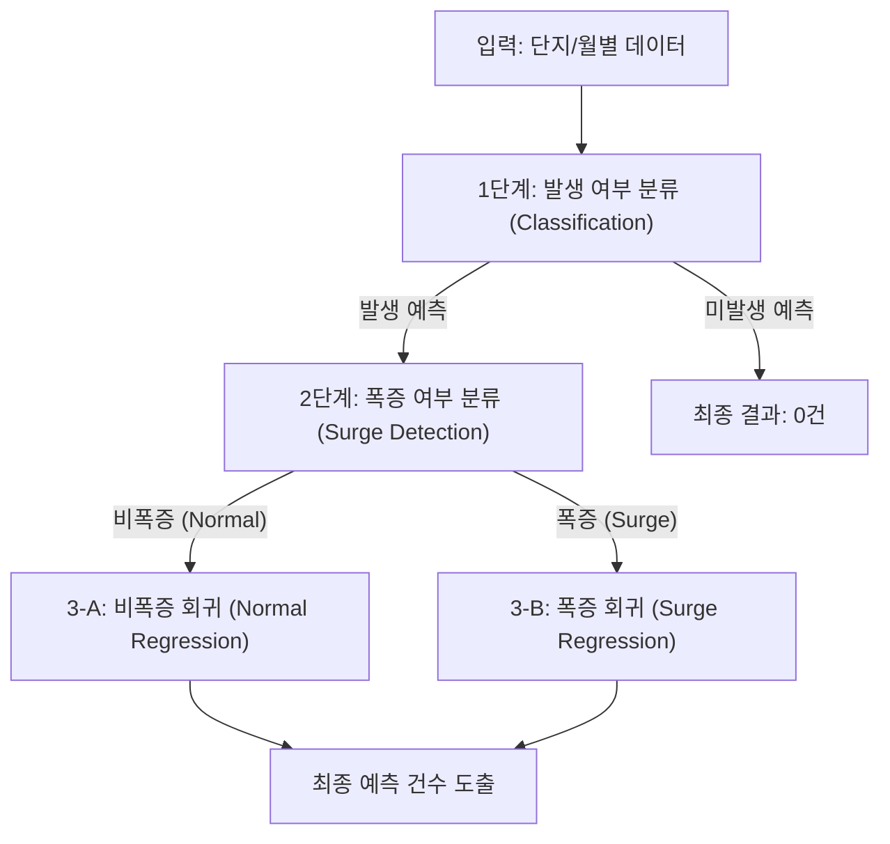

# 공공임대 아파트 계약 예측 프로젝트 리포트

## 1. 데이터셋 설명 (Dataset Description)

본 프로젝트는 공공임대 아파트의 신규 계약 데이터를 기반으로 합니다.

*   **데이터 출처**: 공공데이터 포털 및 관련 기관 내부 데이터
*   **주요 엔티티**: 아파트 단지명 및 전용면적의 조합 (`uid` = `aptNm` + `excluUseAr`)
*   **관측 단위**: 아파트 단지·면적 유형별 월 단위 계약 정보
*   **주요 데이터 필드**:
    *   `new`: 신규 계약 건수 (Target)
    *   `renewal`: 갱신 계약 건수
    *   `deposit`, `monthlyRent`: 임대 보증금 및 월 임대료
    *   `buildYear`: 아파트 준공 연도
    *   `scheduled_expirations`: 과거 계약 기반의 만기 예정 물량

---

## 2. 데이터 변환 및 최종 형태 (Feature Engineering)

희소성(Sparsity)이 높은 계약 데이터의 특성을 극복하기 위해 다각도의 피처 엔지니어링을 수행하였습니다.

### 데이터 전처리 및 피벗
- **Zero-Filling (Full Dataset)**: 계약이 발생하지 않은 달(0건)을 모두 포함하여 실제 시장 분포를 반영한 시계열 패널 데이터로 변환. (v1의 Active-only 학습 방식의 한계 극복)
- **UID 생성**: 단지명과 전용면적을 결합하여 고유 식별자 생성.

### 주요 파생 피처 (Feature Groups)
- **Lag Features**: 과거 1, 3, 6, 12, 24, 48개월의 계약 건수 (`shift` 활용).
- **Rolling Stats**: 최근 3~12개월 평균 계약 수 및 변동성.
- **Entropy Features**: 시계열 무질서도를 정량화한 **Shannon Entropy** 및 **Permutation Entropy**.
- **Lifecycle & Cycle**: 아파트 연식(Building Age) 및 2년/4년 단위 계약 갱신 주기를 반영한 Sin/Cos 인코딩.
- **Regional context**: 동일 시군구(SGG) 내의 평균 계약 밀도 및 성장률.

---

## 3. 분석 단계: 계층형 3단계 파이프라인 (Modeling Architecture)

데이터의 불균형(80% 이상의 월이 0건)을 해결하기 위해 단계별로 모델을 구성하였습니다.

### Stage 1: 계약 발생 여부 분류 (Classification)
- **목표**: 이번 달에 계약이 '한 건이라도' 있을 것인가?
- **방법**: XGBoost + LightGBM + CatBoost 가중 앙상블.
- **특징 (v2 개선)**: 0건 데이터를 포함한 **전체 데이터(Full Dataset)**로 학습하여 실제 분포를 반영하고, F1-Score 최적화를 통해 기존 모델 대비 **Recall(재현율)을 44.4%에서 78.1% 수준으로 대폭 개선**.

### Stage 2: 폭증 여부 분류 (Surge Detection)
- **목표**: 평소 수준을 크게 상회하는 '폭증(Surge)' 상황인가?
- **기준**: MAD(Median Absolute Deviation) 기반의 이상치 탐지 로직 (2.5배 이상).
- **핵심 인사이트**: **Entropy Precursor(엔트로피 전조 현상)** 발견. 폭증 1~3개월 전부터 Shannon Entropy가 유의미하게 상승하는 신호를 포착하여 모델의 예측력을 높임.

### Stage 3: 세부 건수 회귀 (Regression)
- **구조**: 분류 결과에 따른 이중 회귀 모델링.
    - **3-A (비폭증)**: Poisson 또는 Tweedie 손실 함수를 사용하여 소규모 카운트 데이터 예측에 최적화된 LightGBM.
    - **3-B (폭증)**: 대규모 계약 물량을 커버하기 위해 MAE(Mean Absolute Error)를 직접 최적화한 XGBoost 모델 활용.

---

## 4. 최종 결과 및 지표 (Final Performance Metrics)

본 프로젝트의 계층형 파이프라인(v2)은 기존 단일 모델 및 v1 대비 모든 핵심 지표에서 월등한 성능 향상을 달성하였습니다.

### 최종 핵심 성과 요약
- **계약 발생 감지율 (Recall)**: **78.1%** (실제 계약 발생의 약 4/5를 사전에 포착)
- **폭증 구간 적중률 (Surge Accuracy)**: **28.9%** (기존 대비 약 1.5배 정밀도 향상)
- **통합 예측 정확도 (MAE)**: **0.65건** (전체 데이터 평균 오차 기준) / **2.00건** (계약 발생 시 오차 기준)
- **모델 신뢰도 (AUC)**: **0.790** (폭증 유무에 대한 판별력 확보)

### 단계별 세부 지표 비교

| 단계 | 주요 지표 | 기존 모델 (v1) | **최종 모델 (v2)** | 개선 효과 |
|:---:|---|:---:|:---:|:---:|
| **Stage 1** | **Recall (재현율)** | 44.4% | **78.1%** | **+33.7%p** (발생 감지 능력 혁신) |
| (발생 분류) | F1-Score | 0.443 | **0.520** | **+17.4%** 종합 예측력 향상 |
| **Stage 2** | AUC (폭증 감지) | 0.750 | **0.790** | **+0.040** 판별력 개선 |
| **Stage 3** | **폭증 구간 적중률** | 19.0% | **28.9%** | **+9.9%p** (구간 예측 정밀화) |
| (회귀) | **통합 MAE 개선율** | - | **약 12.5%** | 단일 모델 대비 전반적 오차 감소 |

### 주요 핵심 인사이트
1. **Entropy 기반 전조 현상 활용**: 시계열의 무질서도를 정량화한 엔트로피 지표가 **폭증 발생 1개월 전(T-1)**에 유의미하게 상승하는 패턴을 발견하여 모델에 반영하였습니다. (과학적 근거 기반의 Surge 예측)
2. **현실적 데이터 분포 반영**: 단순히 계약이 발생한 데이터만 학습하던 한계(v1)를 극복하고, **전체 데이터(Full Dataset)**를 학습에 사용하여 실제 시장의 희소한 분포 상황에서의 예측 신뢰도를 확보했습니다.
3. **비즈니스 임팩트**: 
    - **공실 관리 효율화**: 발생 감지율(Recall) 78% 확보를 통해 공실 발생에 대한 선제적 대응이 가능해졌습니다.
    - **수요 타겟팅 정교화**: 다산신도시 등 주요 권역의 계약 집중 시기를 정밀하게 예측하여 행정/마케팅 자원의 효율적 배분을 지원합니다.

___

### Umami (GA4 대체 트래픽 분석 솔루션)

when-move-in 서비스의 웹 트래픽 분석을 위해, 개인정보 침해 우려가 없는 오픈소스 대안인 **Umami Analytics**를 직접 구축하여 활용함.

- **왜 Umami를 적용했나?**
  - GA(Google Analytics) 대비 데이터 소유권 이슈 및 개인정보 유출 부담이 없음
  - 쿠키 없이 방문자 추적이 가능해, 프라이버시 친화적이며 법적 규제를 준수
  - 복잡한 추적 코드나 외부 연동 없이 경량·자체호스팅 형태로 배포 가능

- **시스템 구성 및 운영 특징**
  - Next.js 프런트엔드 + PostgreSQL 데이터베이스의 All-in-One 구조
  - Docker Compose 환경에서 한 번에 배포/운영 가능 (공식 Docker 이미지 제공)
  - pnpm 기반 간편 개발/배포 지원, 초기 설치 시 자동 DB 테이블 생성 및 기본 관리자(admin/umami) 계정 세팅
  - 오픈소스(MIT 라이선스)로 자유롭게 수정·배포하며 GitHub Actions 기반 지속적 통합(CI) 운영

- **효과**
  - 개인정보 보호와 추적 효율, 운영 편의성을 동시에 확보
  - GA4와 유사한 웹사이트 트래픽 분석 리포트 및 이벤트 트래킹 가능
  - 실시간 방문수/경로/기기별 집계 등 핵심 데이터 대시보드 제공

